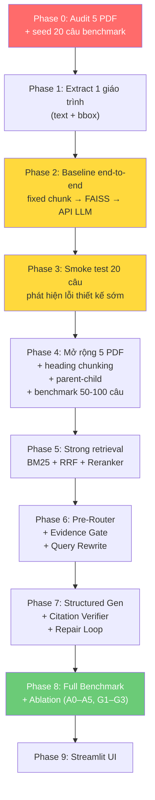

# VietTheory-RAG: Implementation Plan v2

## Bối cảnh

Hệ thống RAG cho 5 giáo trình lý luận chính trị (FPT University), chạy trên **GTX 1660 Ti (6 GB VRAM) + 16 GB RAM**.

### Dữ liệu

| File | Mã môn | Kích thước |
|------|--------|-----------|
| [Giáo trình MLN111.pdf](file:///d:/FPT%20Uni/PROJECT%20LLM/VietTheory-RAG/Tài%20liệu/Giáo%20trình%20MLN111.pdf) | MLN111 — Triết học Mác-Lênin | 2.1 MB |
| [Giáo trình MLN122.pdf](file:///d:/FPT%20Uni/PROJECT%20LLM/VietTheory-RAG/Tài%20liệu/Giáo%20trình%20MLN122.pdf) | MLN122 — Kinh tế Chính trị Mác-Lênin | 1.9 MB |
| [Giáo trình MLN131.pdf](file:///d:/FPT%20Uni/PROJECT%20LLM/VietTheory-RAG/Tài%20liệu/Giáo%20trình%20MLN131.pdf) | MLN131 — CNXH Khoa học | 29.6 MB |
| [Giáo trình HCM202.pdf](file:///d:/FPT%20Uni/PROJECT%20LLM/VietTheory-RAG/Tài%20liệu/Giáo%20trình%20HCM202.pdf) | HCM202 — Tư tưởng Hồ Chí Minh | 12.2 MB |
| [Giáo trình VNR202.pdf](file:///d:/FPT%20Uni/PROJECT%20LLM/VietTheory-RAG/Tài%20liệu/Giáo%20trình%20VNR202.pdf) | VNR202 — Lịch sử Đảng CSVN | 82.1 MB |

---

## Kiến trúc cuối cùng

```
Query
  ↓
Pre-Router
  - subject classification
  - question type (definition / comparison / MCQ / essay)
  - single vs cross-course
  ↓
┌────────────────────┬──────────────────────────┐
│ BM25 retrieval     │ Query → Embedding model  │
│ (CPU)              │ → Query vector           │
│                    │ → FAISS search (CPU)     │
└─────────┬──────────┴─────────────┬────────────┘
          ↓ Reciprocal Rank Fusion + dedup
          ↓
Reranker (GPU, resident)
          ↓
Evidence Sufficiency Gate
  ├── Out-of-domain → "Câu hỏi ngoài phạm vi 5 giáo trình"
  ├── Insufficient → Query rewrite → retrieve lại 1 lần
  │     └── Vẫn thiếu → "Chưa tìm đủ căn cứ trong giáo trình"
  └── Sufficient
          ↓
Structured Generation (API LLM / Ollama baseline)
  → Output: JSON { claims[], citations[] }
          ↓
Citation Verifier
  ├── Tầng code: validity + completeness
  └── Tầng LLM: entailment (1 batch call)
          ├── Pass → Answer
          └── Fail → Repair 1 lần hoặc loại claim
                       ↓
Answer + Chương + Mục + Trang + PDF highlight (bbox)
```

---

## 10 điểm đã sửa so với v1

| # | Vấn đề | Cách sửa |
|---|--------|----------|
| 1 | Thiếu query embedding runtime | Embedding model giữ trên CPU hoặc GPU nhỏ, chạy mỗi query |
| 2 | Router gộp sai vị trí | Tách **Pre-Router** (trước retrieval) và **Evidence Gate** (sau reranker) |
| 3 | Không lưu bbox → không highlight PDF | Lưu `bbox` + `block_id` từ Phase 1, mỗi chunk có `source_spans[]` |
| 4 | Parent chunk không giới hạn | Parent tối đa ~1500 tokens, section dài → chia nhiều parent |
| 5 | Code không tách claim từ văn xuôi | Generator trả **structured JSON** `{claims[], citations[]}` |
| 6 | Verifier phát hiện lỗi nhưng không sửa | Thêm **repair loop** tối đa 1 lần, hoặc loại claim |
| 7 | Rejection dùng ngưỡng tùy ý | Ngưỡng **calibrate trên dev set**, chỉ report trên test set |
| 8 | Ablation chưa chứng minh giá trị RAG | Thêm **closed-book baseline** (cùng LLM, không retrieval) |
| 9 | OCR fallback chỉ đếm ký tự | Dùng **quality score**: char count + unicode ratio + Vietnamese word ratio |
| 10 | Load/unload reranker mỗi request | Reranker **resident trên GPU** khi chạy server |

---

## Proposed Changes — theo thứ tự Vertical Slice

### Phase 0: PDF Quality Audit

> Quyết định toàn bộ pipeline phía sau.

#### [NEW] [scripts/audit_pdfs.py](file:///d:/FPT%20Uni/PROJECT%20LLM/VietTheory-RAG/scripts/audit_pdfs.py)

Dùng PyMuPDF, kiểm tra mỗi file:

| Kiểm tra | Chi tiết |
|----------|----------|
| Text extractability | Ký tự/trang, tỷ lệ trang có text vs trống |
| **OCR quality score** | `char_count` + `unicode_error_ratio` + `vietnamese_word_ratio` + `replacement_char_count (�)` + `text_coverage_vs_page_area` |
| Encoding / Unicode | Lỗi font, dấu tiếng Việt bị hỏng |
| Heading detection | Font size, weight, numbering ("Chương", "I.", "1.1") |
| **Dual page mapping** | `{pdf_page: 12, printed_page: "viii"}` — per-page, không phải 1 offset |
| Reading order | Layout 2 cột, textbox đọc sai thứ tự |
| Header/Footer lặp | Dòng text xuất hiện trên >80% trang |
| Bảng / Khung / Caption | Table, textbox, chú thích ảnh |
| Sample text | 3–5 đoạn mẫu mỗi file |

OCR decision:

```python
needs_ocr = (
    char_count < threshold
    or unicode_error_ratio > 0.05
    or vietnamese_word_ratio < 0.3
)
```

#### [NEW] [reports/pdf_audit_report.md](file:///d:/FPT%20Uni/PROJECT%20LLM/VietTheory-RAG/reports/pdf_audit_report.md)

Báo cáo có cấu trúc cho từng file, bao gồm quality score per page.

---

### Phase 1: Extract 1 giáo trình tốt nhất (vertical slice)

> Chọn file nhỏ nhất, text rõ nhất (dự kiến MLN111 hoặc MLN122) để làm baseline nhanh.

#### [NEW] [src/extraction/pdf_extractor.py](file:///d:/FPT%20Uni/PROJECT%20LLM/VietTheory-RAG/src/extraction/pdf_extractor.py)

- PyMuPDF extract text + **bounding box** theo block/line
- OCR fallback theo trang (chỉ trang có quality score thấp)
- **Không OCR lại trang đã có text layer tốt**

Mỗi trang lưu:

```python
{
    "pdf_file": "Giáo trình MLN111.pdf",
    "subject_code": "MLN111",
    "pdf_page": 36,
    "printed_page": "24",           # string, hỗ trợ "viii", "24", etc.
    "text": "...",
    "extraction_method": "pymupdf",  # hoặc "ocr"
    "char_count": 1850,
    "quality_score": 0.95,
    "blocks": [
        {
            "block_id": 0,
            "bbox": [72.0, 140.5, 515.3, 328.7],
            "text": "...",
            "lines": [
                {"bbox": [72.0, 140.5, 515.3, 155.2], "text": "..."}
            ]
        }
    ]
}
```

> [!IMPORTANT]
> **Bounding box phải lưu từ Phase 1.** Nếu không, highlight PDF sau này phải extract và map lại toàn bộ.

---

### Phase 2: Baseline end-to-end cực nhỏ

> Mục tiêu: chạy được query → answer + trang trong 1–2 ngày. Chưa cần heading chunking, BM25, reranker, router.

#### [NEW] [src/chunking/chunker.py](file:///d:/FPT%20Uni/PROJECT%20LLM/VietTheory-RAG/src/chunking/chunker.py)

**Baseline**: fixed-size chunk ~400 tokens, overlap 50 tokens

Mỗi chunk mang `source_spans` cho highlight:

```python
{
    "chunk_id": "MLN111_p36_c0",
    "text": "...",
    "subject_code": "MLN111",
    "pdf_pages": [36],
    "printed_pages": ["24"],
    "source_spans": [
        {
            "pdf_page": 36,
            "bbox": [72.0, 140.5, 515.3, 328.7],
            "text": "..."
        }
    ]
}
```

#### [NEW] [src/retrieval/indexer.py](file:///d:/FPT%20Uni/PROJECT%20LLM/VietTheory-RAG/src/retrieval/indexer.py)

- Embedding: Qwen3-Embedding-0.6B
- Index: FAISS (flat, inner product hoặc L2)
- Lưu index + chunk mapping xuống disk

#### [NEW] [src/retrieval/retriever.py](file:///d:/FPT%20Uni/PROJECT%20LLM/VietTheory-RAG/src/retrieval/retriever.py)

- **Query embedding** bằng cùng model → query vector → FAISS search
- Top-5 chunks → đưa cho generator

#### [NEW] [src/pipeline/generator.py](file:///d:/FPT%20Uni/PROJECT%20LLM/VietTheory-RAG/src/pipeline/generator.py)

- `GeneratorAdapter` interface — plug bất kỳ provider:

```python
class GeneratorAdapter(ABC):
    @abstractmethod
    def generate(self, query: str, evidence: list[dict]) -> GenerationResult:
        ...

class GeminiGenerator(GeneratorAdapter): ...
class OllamaGenerator(GeneratorAdapter): ...
class OpenAIGenerator(GeneratorAdapter): ...
```

- Baseline: gọi API, trả citation theo trang (chưa structured claims)

#### [NEW] [src/data/metadata_store.py](file:///d:/FPT%20Uni/PROJECT%20LLM/VietTheory-RAG/src/data/metadata_store.py)

- **SQLite** làm metadata store chính
- Tables: `pages`, `chunks`, `source_spans`, `subjects`
- JSON export cho debug

---

### Phase 3: Smoke test 20 câu

> Chạy 20 câu hỏi thủ công trên 1 giáo trình. Phát hiện lỗi thiết kế sớm.

#### [NEW] [benchmark/questions.json](file:///d:/FPT%20Uni/PROJECT%20LLM/VietTheory-RAG/benchmark/questions.json)

Seed 20 câu ban đầu (tạo song song khi audit PDF):

```json
{
    "question": "Đối tượng nghiên cứu của CNXH khoa học là gì?",
    "subject": "MLN131",
    "question_type": "definition",
    "answerable": true,
    "gold_pages": [18, 19],
    "gold_section": "Đối tượng nghiên cứu",
    "gold_evidence": "...",
    "difficulty": "easy"
}
```

#### [NEW] [benchmark/evaluate.py](file:///d:/FPT%20Uni/PROJECT%20LLM/VietTheory-RAG/benchmark/evaluate.py)

- Recall@5, Page Hit Rate, latency
- Output kết quả baseline

---

### Phase 4: Mở rộng đủ 5 giáo trình + Structure Parsing

#### [NEW] [src/extraction/structure_parser.py](file:///d:/FPT%20Uni/PROJECT%20LLM/VietTheory-RAG/src/extraction/structure_parser.py)

Nhận diện heading dựa trên font size/weight + numbering + keywords.

Output: cây cấu trúc Môn → Chương → Mục → Tiểu mục.

#### [MODIFY] [chunker.py](file:///d:/FPT%20Uni/PROJECT%20LLM/VietTheory-RAG/src/chunking/chunker.py)

Nâng cấp từ fixed-size sang **heading-aware parent-child chunking**:

- **Child chunk**: 300–500 tokens, cắt theo ranh giới mục/tiểu mục
- **Parent chunk**: 800–1500 tokens, **tối đa ~2000 tokens**
- Section quá dài → chia nhiều parent:

```
Section 2.1 (8 trang)
├── Parent 2.1-A (1500 tokens)
│   ├── Child 1
│   ├── Child 2
│   └── Child 3
└── Parent 2.1-B (1200 tokens)
    ├── Child 4
    └── Child 5
```

- Loại bỏ header/footer lặp (danh sách từ Phase 0)
- Overlap ~50 tokens giữa child chunks **trong cùng parent**
- Mỗi chunk có `parent_chunk_id` và `source_spans[]` (bbox)

Metadata đầy đủ:

```python
{
    "chunk_id": "MLN111_ch1_s1_c3",
    "text": "...",
    "parent_chunk_id": "MLN111_ch1_s1_pA",
    "subject_code": "MLN111",
    "chapter": "Chương I: Chủ nghĩa duy vật biện chứng",
    "section": "1. ...",
    "subsection": "1.1. ...",
    "pdf_pages": [18, 19],
    "printed_pages": ["6", "7"],
    "source_spans": [
        {"pdf_page": 18, "bbox": [72, 140, 515, 328], "text": "..."},
        {"pdf_page": 19, "bbox": [72, 72, 515, 200], "text": "..."}
    ]
}
```

#### Mở rộng benchmark → 50–100 câu

Bổ sung thêm các nhóm:

| Nhóm | Mô tả |
|------|-------|
| Exact term | Thuật ngữ đúng như sách |
| Paraphrase | Hỏi khác từ ngữ |
| Multi-hop | Cần ghép 2+ đoạn |
| Cross-course | So sánh giữa 2 môn |
| MCQ | Giải thích tại sao đáp án khác sai |
| Unanswerable | Không có trong giáo trình |
| Adversarial | Câu có tiền đề sai |

**Chia dev/test:**
- **Dev set** (~60%): chọn model, top-k, threshold
- **Test set** (~40%): chỉ chạy 1 lần để báo cáo cuối

> [!WARNING]
> Nếu chỉnh threshold và report trên cùng 1 set → kết quả bị optimistic bias.

---

### Phase 5: Strong Retrieval

#### [MODIFY] [retriever.py](file:///d:/FPT%20Uni/PROJECT%20LLM/VietTheory-RAG/src/retrieval/retriever.py)

- Thêm **BM25** (tokenizer tiếng Việt: underthesea hoặc pyvi)
- **Reciprocal Rank Fusion** merge BM25 + FAISS
- Dedup chunks trùng lặp
- Output: top 20 candidates

Luồng query:

```
Query
├── BM25 search (CPU) → top 20
└── Embedding model (CPU/GPU nhỏ) → query vector → FAISS → top 20
    ↓
RRF merge + dedup → top 20
```

> [!NOTE]
> Embedding model cho query phải **luôn available** (CPU hoặc GPU nhỏ), không load/unload mỗi request.

#### [NEW] [src/retrieval/reranker.py](file:///d:/FPT%20Uni/PROJECT%20LLM/VietTheory-RAG/src/retrieval/reranker.py)

- Model: Qwen3-Reranker-0.6B
- **Resident trên GPU** khi server chạy (không load/unload mỗi request)
- Batch size 1–4
- Input: query + 20 candidates → output: top 5 + parent expansion nếu cần

Quản lý GPU khi server chạy:

```
Server startup:
  → Load reranker (GPU) — giữ resident
  → Load embedding model (CPU hoặc GPU nếu đủ VRAM)

Mỗi query:
  → BM25 (CPU)
  → Embed query (CPU/GPU — model đã loaded)
  → FAISS search (CPU)
  → Rerank (GPU — model đã loaded)
  → API LLM (network)

Chỉ unload reranker khi:
  → Chuyển sang Ollama baseline
  → Re-index toàn bộ
  → GPU thiếu VRAM
```

---

### Phase 6: Pre-Router + Evidence Sufficiency Gate

#### [NEW] [src/pipeline/pre_router.py](file:///d:/FPT%20Uni/PROJECT%20LLM/VietTheory-RAG/src/pipeline/pre_router.py)

Chạy **trước** retrieval:

| Phân loại | Mục đích |
|-----------|----------|
| Subject | Câu hỏi thuộc môn nào → filter index theo `subject_code` |
| Question type | Definition / comparison / MCQ / essay / exact quote |
| Single vs cross-course | Cần tìm trong 1 hay nhiều giáo trình |
| Obvious out-of-domain | "Thời tiết hôm nay" → reject ngay |

Ban đầu: rule-based (keyword matching, subject terms). Sau: có thể dùng classifier nhẹ.

#### [NEW] [src/pipeline/evidence_gate.py](file:///d:/FPT%20Uni/PROJECT%20LLM/VietTheory-RAG/src/pipeline/evidence_gate.py)

Chạy **sau** reranker:

| Trường hợp | Xử lý |
|------------|--------|
| Evidence đủ (score > threshold) | → Generate |
| Evidence yếu (score trung bình) | → **Query rewrite** → retrieve lại 1 lần |
| Vẫn yếu sau retry | → "Câu hỏi có liên quan nhưng chưa tìm đủ căn cứ" |
| Không có evidence phù hợp | → "Câu hỏi ngoài phạm vi 5 giáo trình" |

> [!IMPORTANT]
> Ngưỡng rejection **không hardcode**. Phải calibrate trên dev set có câu answerable + unanswerable + adversarial.

---

### Phase 7: Structured Generation + Citation Verifier + Repair

#### [MODIFY] [generator.py](file:///d:/FPT%20Uni/PROJECT%20LLM/VietTheory-RAG/src/pipeline/generator.py)

Generator trả **structured JSON**, không phải văn xuôi tự do:

```json
{
    "direct_answer": "Đáp án A",
    "claims": [
        {
            "claim_id": "C1",
            "text": "CNXH khoa học nghiên cứu quy luật...",
            "citations": ["S1"]
        },
        {
            "claim_id": "C2",
            "text": "Khác với triết học và KTCT...",
            "citations": ["S2", "S3"]
        }
    ]
}
```

Frontend render JSON → câu trả lời tự nhiên + citation links.

#### [NEW] [src/pipeline/citation_verifier.py](file:///d:/FPT%20Uni/PROJECT%20LLM/VietTheory-RAG/src/pipeline/citation_verifier.py)

**Tầng 1 — Code (rẻ, chắc chắn):**
- Citation ID tồn tại?
- Citation thuộc retrieved evidence?
- Claim nào thiếu citation? (completeness — dễ vì output đã structured)
- Citation rỗng?

**Tầng 2 — LLM (1 batch call):**
- Gửi tất cả claims + evidence → model trả `supported / partially_supported / unsupported`

**Repair loop:**

```
Generate (1 API call)
  → Code verify
  → LLM verify (1 API call)
  ├── All pass → Answer
  └── Has failures
        → Repair prompt với evidence + failed claims (1 API call)
        → Code verify lại
        ├── Pass → Answer
        └── Still fails → Loại claim unsupported, trả answer partial
```

> Thông thường: **2 API calls**. Tối đa: **3 khi cần repair**. Không sửa được → loại claim hoặc trả "chưa đủ căn cứ".

---

### Phase 8: Benchmark đầy đủ + Ablation

#### [MODIFY] [benchmark/evaluate.py](file:///d:/FPT%20Uni/PROJECT%20LLM/VietTheory-RAG/benchmark/evaluate.py)

**Metrics:**

| Metric | Đo gì |
|--------|--------|
| Recall@5, @10 | Retrieval tìm đúng chunk |
| nDCG@10 | Chất lượng ranking |
| MRR | Chunk đúng xếp thứ bao nhiêu |
| Page Hit Rate | Có trả đúng trang |
| Citation Precision | Citation nào valid & entailed |
| Citation Recall | Claim nào có đủ citation |
| Unsupported Claim Rate | % claim không có evidence |
| Answer Correctness | Câu trả lời đúng vs gold answer |
| Faithfulness | Câu trả lời có trung thành với evidence |
| False Acceptance Rate | Thiếu evidence nhưng vẫn trả lời |
| False Rejection Rate | Có evidence nhưng từ chối |
| Latency p50, p95 | Thời gian response |

**Ablation — Bảng 1: Giá trị của RAG pipeline** (cùng 1 LLM):

| Config | Mô tả |
|--------|--------|
| A0 | **Closed-book** — LLM trả lời không retrieval |
| A1 | Dense RAG cơ bản (FAISS only) |
| A2 | Hybrid RAG (BM25 + FAISS) |
| A3 | A2 + Reranker |
| A4 | A3 + Parent-child chunking |
| A5 | A4 + Corrective retrieval (query rewrite) |

**Ablation — Bảng 2: Ảnh hưởng của generator** (giữ nguyên pipeline):

| Config | Mô tả |
|--------|--------|
| G1 | Ollama Qwen3 1.7B |
| G2 | Ollama Qwen3 4B (nếu chạy được) |
| G3 | API model (Gemini / GPT-4o-mini) |

---

### Phase 9: Streamlit UI

#### [NEW] [src/frontend/](file:///d:/FPT%20Uni/PROJECT%20LLM/VietTheory-RAG/src/frontend/)

- **Streamlit** — ưu tiên tốc độ phát triển
- Hiển thị: structured answer → render tự nhiên + citation links
- Click citation → mở đúng trang PDF + **highlight bbox**
- Chọn môn, xem nguồn trích dẫn
- Next.js chỉ làm nếu còn thời gian sau khi core đạt metric tốt

#### [NEW] [src/backend/app.py](file:///d:/FPT%20Uni/PROJECT%20LLM/VietTheory-RAG/src/backend/app.py)

- FastAPI server
- Endpoints: `/ask`, `/health`, `/feedback`
- Orchestrate toàn bộ pipeline

---

## Cấu trúc thư mục

```
VietTheory-RAG/
├── Tài liệu/                        # 5 PDF (đã có)
├── scripts/
│   └── audit_pdfs.py                 # Phase 0
├── benchmark/
│   ├── questions.json                # Ground truth (dev + test)
│   └── evaluate.py                   # Metrics
├── reports/
│   └── pdf_audit_report.md
├── src/
│   ├── extraction/
│   │   ├── pdf_extractor.py          # Text + bbox + OCR fallback
│   │   └── structure_parser.py       # Heading tree
│   ├── chunking/
│   │   └── chunker.py                # Parent-child + source_spans
│   ├── retrieval/
│   │   ├── indexer.py                # FAISS + BM25 build
│   │   ├── retriever.py              # Hybrid search + RRF
│   │   └── reranker.py               # Qwen3-Reranker-0.6B
│   ├── pipeline/
│   │   ├── pre_router.py             # Subject + question type
│   │   ├── evidence_gate.py          # Sufficiency + rejection
│   │   ├── generator.py              # GeneratorAdapter + structured output
│   │   └── citation_verifier.py      # Code + LLM + repair
│   ├── data/
│   │   └── metadata_store.py         # SQLite
│   ├── backend/
│   │   └── app.py                    # FastAPI
│   └── frontend/
│       └── app.py                    # Streamlit
├── data/
│   ├── extracted/                    # Per-page JSON with bbox
│   ├── chunks/                       # Chunks + source_spans
│   └── indexes/                      # FAISS index + BM25
├── configs/
│   └── config.yaml
└── requirements.txt
```

---

## Thứ tự thực hiện (Vertical Slice)



> [!IMPORTANT]
> **Vertical slice**: Phase 0–3 cho ra hệ thống chạy được end-to-end trên 1 giáo trình trước khi xây phần phức tạp. Phát hiện lỗi thiết kế sớm, không chờ xong hết mới test.

---

## Quản lý tài nguyên GPU/RAM

**Indexing (1 lần):**
```
Load embedding (GPU) → embed tất cả chunk → save index → unload
```

**Server runtime:**
```
Startup:
  → Load embedding model (CPU — cho query embedding)
  → Load reranker (GPU — resident)

Mỗi query:
  → BM25 (CPU)
  → Embed query (CPU — model đã loaded)
  → FAISS search (CPU — index in memory)
  → Rerank (GPU — model đã loaded)
  → API LLM (network — không tốn local resource)
  → Citation verify: code + 1 API call
```

> [!TIP]
> Embedding query trên CPU với model 0.6B: latency ~50–200ms, chấp nhận được. GPU dành cho reranker.

---

## Quyết định đã chốt

### 1. API LLM generator chính
- **Generator ban đầu**: Gemini 3.5 Flash (Free Tier)
- **Local baseline**: Ollama Qwen3 1.7B
- **Benchmark nhiều API**: để Phase 8 khi pipeline ổn và test set đã khóa
- Giữ `GeneratorAdapter` để đổi provider dễ dàng

### 2. OCR engine
- **Mặc định nếu cần**: PaddleOCR (trả bbox + confidence, hỗ trợ tiếng Việt)
- **Fallback**: Tesseract
- **Surya**: chỉ thử nếu layout/reading order phức tạp
- Quyết định cuối cùng sau audit, lấy ~20 trang đại diện để so

### 3. Mã môn học ✅
| Mã | Tên môn |
|----|---------|
| MLN111 | Triết học Mác – Lênin |
| MLN122 | Kinh tế Chính trị Mác – Lênin |
| MLN131 | Chủ nghĩa Xã hội Khoa học |
| HCM202 | Tư tưởng Hồ Chí Minh |
| VNR202 | Lịch sử Đảng Cộng sản Việt Nam |

---

## Verification Plan

### Automated Tests
- Unit test: extractor, chunker, retriever, reranker, verifier
- Integration test: query → structured answer + citation end-to-end
- Benchmark script trên dev set → metrics table

### Manual Verification
- Kiểm tra sample text + bbox đúng vị trí trên PDF
- Click citation → đúng trang sách
- Demo 20 câu đa dạng
- So sánh closed-book vs RAG vs các ablation configs
