# VietTheory-RAG — MLN111 Assistant

Trợ lí hội thoại chuyên biệt cho giáo trình **Triết học Mác–Lênin (MLN111)**. Hệ thống
truy xuất đúng đoạn giáo trình, trả lời bằng tiếng Việt, dẫn tới trang PDF, hiểu câu hỏi nối
tiếp và lưu lịch sử riêng cho từng tài khoản.

[](https://drive.google.com/drive/folders/1P9UV9NdyWku3mCpswza__0zfxnKPtfmK?usp=sharing)

**[Xem video demo đầy đủ trên Google Drive](https://drive.google.com/drive/folders/1P9UV9NdyWku3mCpswza__0zfxnKPtfmK?usp=sharing)**

> Phạm vi production hiện tại chỉ gồm MLN111. Các PDF và artifacts môn khác được bảo toàn
> trong workspace nhưng không được runtime nạp hoặc dùng để trả lời.

## Điểm nổi bật

- Hybrid retrieval: BM25 + Qwen3 dense embedding, hợp nhất bằng Reciprocal Rank Fusion.
- Query planning cho câu so sánh; Qwen3 cross-encoder rerank trên NVIDIA CUDA.
- Heading-aware parent/child chunks: child để tìm chính xác, parent để cung cấp đủ ngữ cảnh.
- Evidence gate và một lần corrective retrieval trước khi từ chối.
- Gemini sinh JSON có cấu trúc; citation được canonicalize, khử trùng và kiểm tra tất định.
- Hội thoại nhiều lượt, xử lý các tham chiếu như “chúng”, “ý đó”, “định nghĩa đó”.
- Tài khoản riêng, mật khẩu hash bằng scrypt, session token lưu dưới dạng SHA-256.
- Mỗi tài khoản chỉ xem và thao tác được lịch sử của chính mình.
- Giao diện Streamlit kiểu chat, nguồn có thể mở để đọc toàn bộ parent passage.

## Pipeline hệ thống

```mermaid
flowchart LR
    PDF["MLN111 PDF"] --> EX["PyMuPDF extraction + bbox"]
    EX --> CH["Heading-aware parent/child chunks"]
    CH --> BM["BM25"]
    CH --> DE["Qwen3 Embedding + FAISS"]
    BM --> RRF["Reciprocal Rank Fusion"]
    DE --> RRF
    RRF --> RR["Qwen3 GPU Reranker"]
    RR --> PE["Parent expansion"]
    PE --> EG["Evidence gate"]
    EG --> GM["Gemini structured generation"]
    GM --> CV["Citation verification"]
    CV --> API["FastAPI + account isolation"]
    API --> UI["Streamlit conversational UI"]
```



Luồng chi tiết và trách nhiệm từng module nằm tại
[docs/architecture.md](docs/architecture.md).

| Bước | Input → Output | Kỹ thuật chính |
|---:|---|---|
| 1 | PDF → page/block/line có tọa độ | PyMuPDF, bbox preservation, OCR fallback |
| 2 | Page structure → parent/child chunks | Heading-aware parsing, stable IDs |
| 3 | Câu hỏi → lexical candidates | Vietnamese-friendly BM25 |
| 4 | Câu hỏi → semantic candidates | Qwen3-Embedding-0.6B + FAISS cosine |
| 5 | Hai danh sách → fused candidates | Reciprocal Rank Fusion + chunk deduplication |
| 6 | Câu so sánh → candidates đủ hai vế | Comparison query planner + round-robin merge |
| 7 | Candidates → thứ hạng liên quan | Qwen3-Reranker-0.6B cross-encoder trên CUDA |
| 8 | Child hits → đoạn nguồn đầy đủ | Parent expansion, sibling deduplication |
| 9 | Evidence → accept/rewrite/refuse | Calibrated evidence gate, tối đa một retry |
| 10 | Evidence → câu trả lời JSON | Gemini Flash Lite, temperature 0.1, JSON schema |
| 11 | Answer → grounded answer | Canonical span, citation deduplication, verifier |
| 12 | Response → UI và lịch sử riêng | FastAPI, Streamlit, SQLite ownership checks |

## Model và kỹ thuật

| Thành phần | Lựa chọn | Vai trò |
|---|---|---|
| Lexical retrieval | BM25 | Bắt từ khóa, thuật ngữ và tên riêng chính xác |
| Dense retrieval | Qwen3-Embedding-0.6B | Tìm paraphrase và tương đồng ngữ nghĩa tiếng Việt |
| Vector search | FAISS cosine | Tìm kiếm vector cục bộ, index có manifest và mapping kiểm tra được |
| Fusion | Reciprocal Rank Fusion | Kết hợp thứ hạng BM25 và dense không phụ thuộc thang điểm |
| Query planning | Comparison query variants | Bảo đảm hai vế của câu so sánh đều có candidates |
| Reranking | Qwen3-Reranker-0.6B | Cross-encoder chấm lại candidates trên GPU |
| Context | Parent expansion | Dẫn nguồn dài, đủ ý nhưng vẫn truy xuất bằng child chính xác |
| Generation | Gemini Flash Lite | Tạo câu trả lời tiếng Việt theo JSON schema |
| Grounding | Evidence gate + verifier | Từ chối ngoài phạm vi và kiểm tra claim–citation |
| Serving | FastAPI + Streamlit | API, tài khoản, lịch sử và giao diện chat |
| Persistence | SQLite | Users, hashed sessions, conversations và feedback cục bộ |

Runtime mặc định dùng `Qwen/Qwen3-Embedding-0.6B` revision
`97b0c614be4d77ee51c0cef4e5f07c00f9eb65b3` và `Qwen3-Reranker-0.6B`.
Model được nạp từ `models/` và không được commit vào Git.

## Benchmark MLN111 v1.0

Benchmark đã **frozen ngày 2026-08-12**:

- 70 câu development đã human-verified và được công khai;
- 30 câu hidden test đã human-verified, nội dung và gold giữ private;
- 21 easy, 31 medium, 18 hard;
- 59 single-chunk và 11 multi-chunk;
- 66 answerable, 2 false-premise và 2 out-of-scope;
- schema, corpus manifest và SHA-256 được cố định trong release manifest.

### Bảng kết quả benchmark

| Metric | Development | Hidden test |
|---|---:|---:|
| Recall@1 | 82.35% | — |
| Recall@3 | 97.06% | — |
| Recall@5 | **97.06%** | **92.86%** |
| Recall@10 | 97.06% | — |
| MRR | 89.22% | — |
| nDCG@5 | 87.70% | — |
| Evidence Group Recall@5 | 93.67% | — |
| Full Evidence Success@5 | **92.65%** | **92.86%** |
| Latency p50 | 10.32 s | — |
| Latency p95 | 11.15 s | — |

**Cấu hình đo:** BM25 + Qwen3-Embedding-0.6B → RRF → Qwen3-Reranker-0.6B;
`candidate_k=12`, đánh giá đến `top_k=10`. Cấu hình được frozen trước khi chạy hidden test.

Development retrieval metrics dùng **68 câu có thể chấm retrieval**; hai câu out-of-scope
được validator giữ trong bộ 70 nhưng không đưa vào retrieval denominator. Hidden test chỉ công
khai aggregate metrics để tránh tuning theo test. Chi tiết tại
[docs/benchmark.md](docs/benchmark.md).

## Cấu trúc repository

```text
src/viettheory/
├── extraction/       PDF extraction, OCR fallback, bbox và structure parsing
├── chunking/         baseline và structured parent/child chunking
├── retrieval/        BM25, FAISS dense, RRF, planner, reranker, parent expansion
├── pipeline/         routing, evidence gate, generation, citation verification
├── backend/          FastAPI, authentication, conversations, feedback
├── frontend/         Streamlit UI và assets
├── evaluation/       retrieval/evidence-group metrics
└── runtime.py        assembly production MLN111-only

benchmark/v1.0/       public development split và frozen manifest
benchmark_private/    hidden test, review và reports; luôn Git-ignored
scripts/              benchmark preparation và evaluation
tests/                unit, contract, isolation và smoke tests
```

## Cài đặt

Yêu cầu:

- Python 3.11 trở lên;
- NVIDIA GPU có CUDA cho cấu hình production;
- model embedding/reranker cục bộ trong `models/`;
- corpus/index MLN111 đã xử lý trong `data/processed/MLN111/structured_v1/`;
- Gemini API key hợp lệ.

```powershell
python -m venv .venv
.\.venv\Scripts\python.exe -m pip install -e ".[dev,retrieval,app]"
Copy-Item .env.example .env
```

Điền `GEMINI_API_KEY` vào `.env`. Không commit `.env` hoặc chụp key trong ảnh/video.

## Chạy local

Terminal 1 — API:

```powershell
.\.venv\Scripts\mln111-api.exe
```

Đợi `Application startup complete`, sau đó terminal 2 — UI:

```powershell
.\.venv\Scripts\python.exe -m streamlit run src\viettheory\frontend\app.py
```

Mở `http://localhost:8501`; health endpoint là `http://127.0.0.1:8000/health`.

## Kiểm tra chất lượng

```powershell
.\.venv\Scripts\python.exe -m ruff check src tests
.\.venv\Scripts\python.exe -m ruff format --check src tests
.\.venv\Scripts\python.exe -m mypy src
.\.venv\Scripts\python.exe -m pytest -q
```

Trạng thái release hiện tại: **84 tests passed**, Ruff clean, format clean và Mypy strict clean.

## Bảo mật và quyền dữ liệu

- `.env`, `API KEY/`, PDFs, models, indexes, processed data, SQLite và logs bị Git ignore.
- Password được hash bằng scrypt với salt ngẫu nhiên; không lưu plaintext.
- Session token là opaque random token; database chỉ lưu SHA-256 và thời hạn 7 ngày.
- Conversation ownership được kiểm tra ở mọi endpoint list/read/chat/delete.
- Hidden benchmark không nằm trong Git history; chỉ aggregate metrics và checksums được public.
- Giảng viên đã cho phép sử dụng, công khai và phân phối lại PDF; repository vẫn không commit
  PDF để tránh Git history phình lớn. Chi tiết: [docs/data-license.md](docs/data-license.md).
- Quick Tunnel chỉ dành cho demo tạm; triển khai 24/7 cần GPU host, HTTPS và secret management.

## Trạng thái và giới hạn

- Product đã hoạt động end-to-end cho MLN111 và có benchmark v1.0 frozen.
- Runtime hiện tối ưu cho một GPU local và một process API.
- SQLite phù hợp demo/single-host; production nhiều replica nên chuyển sang PostgreSQL.
- API chưa có email verification, password reset, rate limiting hoặc RBAC quản trị.
- Internet search không được bật; câu hỏi ngoài MLN111 được từ chối rõ ràng.
- PDFs và model weights không đi kèm repository; người chạy phải chuẩn bị artifacts cục bộ.

## Tác giả

Trợ lí được tạo bởi **Tuân**, một gymer thích học Triết.
