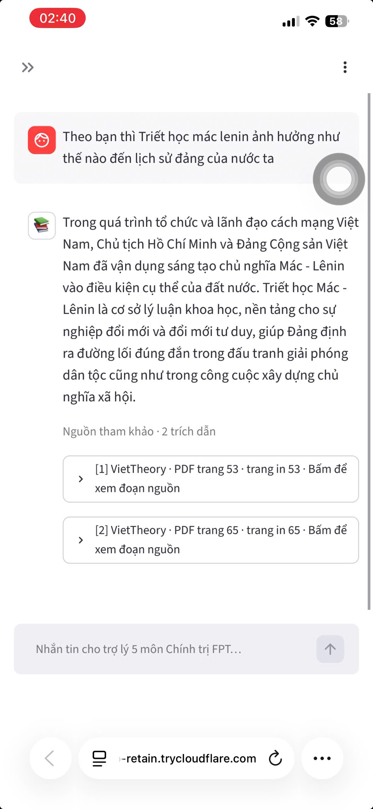
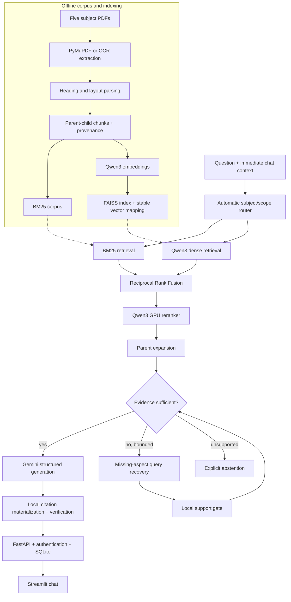

# VietTheory Agentic Nexus

**Evidence-guided Agentic RAG for five Vietnamese political-theory subjects at FPT University.**

VietTheory Agentic Nexus is a research-oriented question-answering system for **MLN111,
MLN122, MLN131, HCM202, and VNR202**. It combines hybrid retrieval, neural reranking,
parent-aware evidence expansion, a bounded Evidence Judge/Recovery loop, grounded generation,
and deterministic PDF citations in one subject-agnostic runtime.

<p align="center">
  <a href="https://drive.google.com/drive/folders/1KsY9tnl6FhBWzuIPTpQljdTq2umZT42b?usp=sharing">
    
  </a>
</p>

**[Watch the full demo](https://drive.google.com/drive/folders/1KsY9tnl6FhBWzuIPTpQljdTq2umZT42b?usp=sharing)** ·
**[Architecture](docs/architecture.md)** ·
**[Benchmark protocol](docs/benchmark.md)** ·
**[Experimental results](docs/experimental-results-v1.md)**

> **Release boundary — 15 August 2026.** All five corpora pass deterministic artifact and index
> readiness checks. Natural QA v2 Gold v1.0 contains 500 human-verified questions: 350 public
> development questions and 150 private held-out questions. Frozen B0 was evaluated once on the
> held-out split. Recovery V2.1 passed its public-development gate but has not been hidden-tested,
> so it remains opt-in. Graph and role-separated coordination candidates are retained as negative
> ablations rather than marketed as improvements.

## At a glance

| Layer | Implementation | Current evidence |
|---|---|---|
| Corpus | Five textbooks, native extraction or OCR, stable provenance | 5/5 readiness audits pass |
| Retrieval B0 | BM25 + Qwen dense + RRF + Qwen reranker + parent expansion | 98.64% held-out Recall@5 |
| Evidence completeness | Required evidence groups and Full Evidence@k | 94.56% held-out Full Evidence@5 |
| Agentic candidate | Gemini Evidence Judge + bounded targeted recovery | 94.26% dev Full Evidence@5; +1 win, 0 losses |
| Grounded generation | Structured Gemini output materialized against local evidence | deterministic citation IDs and page spans |
| Product | FastAPI, Streamlit, SQLite, authentication, isolated histories | local GPU demo |
| Evaluation | Natural QA, Evidence Sufficiency, memory/tool contracts, ablations | 500 verified natural questions |

## 1. Problem

A textbook assistant can sound convincing while being wrong. For Vietnamese political-theory
courses, a reliable answer must solve several problems at once:

1. **Lexical and semantic mismatch.** A student may paraphrase a concept instead of copying the
   terminology used in the textbook.
2. **Incomplete evidence.** Comparison, synthesis, and cause-effect questions often require more
   than one passage. Retrieving one relevant chunk is not enough.
3. **Lost document structure.** Small chunks rank well but may remove a heading, definition, or
   conclusion needed to interpret the passage correctly.
4. **Unsupported generation.** An LLM can fill missing information from parametric knowledge and
   produce an answer that the selected textbook does not support.
5. **Citation hallucination.** Page numbers and quotations generated directly by an LLM cannot be
   trusted without deterministic validation.
6. **Cross-subject ambiguity.** The same political terms may appear in several courses. Requiring
   users to choose a subject is inconvenient, but unrestricted retrieval can contaminate results.
7. **Evaluation leakage.** Tuning against every benchmark question makes final metrics unreliable.
8. **Agentic cost and regressions.** Running an agent loop for every easy question adds latency and
   may displace evidence that frozen retrieval already found.

The research question is therefore not simply *“Can an LLM answer these questions?”* It is:

> Can a five-subject assistant retrieve all required textbook evidence, recognize when evidence
> is incomplete, recover only the missing aspect, and return a verifiable answer without damaging
> already-correct retrieval?

## 2. Design questions

- How should native PDFs and OCR documents share one provenance-preserving schema?
- How can child chunks optimize retrieval while parent context preserves complete arguments?
- How should lexical and dense rankings be combined without calibrating incompatible scores?
- When should the runtime search one subject, and when should it search globally?
- Can evidence sufficiency be judged independently from answer generation?
- How can recovery be bounded so a false activation cannot freely rewrite B0's top results?
- Which agentic, graph, memory, and tool components produce measured gains rather than architectural
  complexity alone?
- How should natural QA, controlled Judge cases, and private held-out evaluation complement each
  other?

## 3. Solution and key contributions

### 3.1 One canonical five-subject corpus

Every extracted block preserves subject, document, PDF page, printed page when available,
bounding box, line text, heading path, parent ID, child ID, extraction method, and artifact
checksum. The same registry drives offline processing and online retrieval; there are not five
separate chatbot implementations.

| Subject | Course | Extraction | Pages | Searchable children | Readiness |
|---|---|---:|---:|---:|---|
| MLN111 | Marxist-Leninist Philosophy | Native PDF | 285 | 602 | Passed |
| MLN122 | Marxist-Leninist Political Economy | Native PDF | 262 | 346 | Passed |
| MLN131 | Scientific Socialism | Tesseract OCR | 273 | 334 | Passed |
| HCM202 | Ho Chi Minh Ideology | Tesseract OCR | 271 | 331 | Passed |
| VNR202 | History of the Communist Party of Vietnam | Tesseract OCR | 230 | 459 | Passed |

“Ready” here means artifact, provenance, parent-child, checksum, subject-purity, and vector-mapping
integrity. It does **not** mean every OCR line or heading has been manually certified.

### 3.2 Parent-child retrieval

Small child chunks are used as retrieval units. After reranking, each selected child expands to a
bounded parent passage for evidence judging, answer generation, and citation display. This avoids
forcing one chunk size to serve two conflicting objectives: ranking precision and explanatory
completeness.

### 3.3 Hybrid retrieval and neural reranking

- **BM25** captures exact terminology, names, dates, and textbook phrases.
- **Qwen3-Embedding-0.6B + FAISS** captures Vietnamese paraphrases and semantic similarity.
- **Reciprocal Rank Fusion** combines rankings without treating BM25 and cosine scores as directly
  comparable.
- **Qwen3-Reranker-0.6B** reranks a bounded candidate pool on CUDA.
- **Automatic scope routing** selects a strong subject match or leaves ambiguous/cross-subject
  questions in global mode. The public UI no longer requires a subject selector.

### 3.4 Evidence-guided Agentic Recovery

The optional V2.1 path does not create an unbounded autonomous loop. It is a measured,
fail-safe controller:

1. Run frozen B0.
2. Ask a structured Evidence Judge whether required aspects are covered.
3. If evidence is incomplete, generate at most two missing-aspect recovery queries.
4. Retrieve candidates through the same frozen hybrid path.
5. Use a local Qwen support gate before inserting recovered evidence.
6. Preserve B0 ordering and replace only the tail when the recovery candidate has stronger
   missing-aspect support.
7. Judge once more, then answer or abstain.

The unrestricted V2.0 design was rejected because false activations damaged good B0 evidence.
V2.1 exists specifically to constrain that failure mode.

### 3.5 Deterministic citation grounding

Gemini returns answer claims plus IDs of retrieved evidence. The server—not the model—materializes
canonical page citations, source spans, excerpt text, and citation IDs from local corpus metadata.
Unknown IDs fail validation; duplicate citations are removed; unsupported claims can be refused.

### 3.6 Account-isolated conversations

The application provides username/password authentication, opaque session tokens, ownership
checks on every conversation operation, and separate SQLite-backed history for each account.
Immediate conversation context resolves follow-ups without treating memory as textbook evidence.

## 4. System architecture



### Responsibilities by stage

| Stage | Main technique | Responsibility |
|---|---|---|
| Extraction | PyMuPDF, bounding boxes, Tesseract OCR fallback | preserve page/layout provenance |
| Structure | deterministic parsing with selective Gemini audit tools | infer headings and parent boundaries |
| Chunking | heading-aware parent/child hierarchy | separate retrieval and generation granularity |
| Retrieval | BM25 + Qwen dense | lexical and semantic candidate recall |
| Fusion | RRF | combine heterogeneous ranks |
| Reranking | Qwen cross-encoder on CUDA | improve early precision |
| Agentic control | Evidence Judge + bounded Recovery V2.1 | act only on missing evidence |
| Generation | Gemini structured output, low temperature | grounded Vietnamese answer composition |
| Verification | local evidence IDs, spans, citation canonicalization | prevent fabricated source metadata |
| Serving | FastAPI, Streamlit, SQLite | API, UI, auth, histories, feedback |

## 5. Benchmark design

### 5.1 Natural QA v2 Gold v1.0

Natural QA v2 contains **500 human-verified questions**, 100 for each subject. Every item records
question type, difficulty, answerability, gold answer, pages, evidence groups, acceptable child
and parent evidence, review gates, and provenance.

| Split | Per subject | Total | Visibility | Purpose |
|---|---:|---:|---|---|
| Development | 70 | 350 | Public | design, ablation, error analysis |
| Held-out | 30 | 150 | Private question-level data | one-shot final evaluation |

Three held-out questions are intentionally unanswerable, so retrieval metrics use 147 answerable
questions. The public release contains development data, aggregate held-out metrics, manifests,
and SHA-256 checksums—not private question-level rankings.

### 5.2 Evidence-group evaluation

A multi-evidence question is successful only when the top-k contains at least one acceptable
passage from **every required evidence group**. This produces metrics that ordinary Recall@k
cannot express:

- Evidence Group Recall@k
- Partial Evidence Coverage@k
- Full Evidence Success@k

### 5.3 Evidence Sufficiency benchmark

A separate controlled pilot evaluates whether a Judge can distinguish `SUFFICIENT`, `PARTIAL`,
`MISSING`, and `WRONG_ASPECT` contexts. Source-question grouping prevents related perturbations
from leaking across development and held-out splits. Lexical and TF-IDF shortcut baselines test
whether the task can be solved without evidence reasoning.

### 5.4 Human verification and freezing

The 500-question draft received 452 approve, 26 revise, and 22 reject decisions. Revised questions
and replacements were rechecked before release; generation alone never grants `verified` status.
The final release validates 500/500 records with manifests and checksums.

## 6. Baselines and ablations

### Historical MLN111 development ablation

| Configuration | Recall@1 | Recall@5 | MRR | nDCG@5 | Full Evidence@5 |
|---|---:|---:|---:|---:|---:|
| Structured BM25 | 51.47% | 85.29% | 66.33% | 67.60% | 77.94% |
| Structured dense | 58.82% | 92.65% | 74.15% | 75.34% | 85.29% |
| Structured hybrid RRF | 61.76% | 95.59% | 76.48% | 78.19% | 89.71% |
| Hybrid + reranker | **83.82%** | **98.53%** | **90.69%** | **88.78%** | 92.65% |
| Planner + hybrid + reranker | **83.82%** | **98.53%** | **90.69%** | **88.78%** | 92.65% |

Per-query transitions show that the reranker produced 21 wins, 2 losses, 1 mixed result, and 44
ties. The original comparison planner produced 0 wins, 0 losses, and 68 ties, so it is preserved
as an operationally redundant negative ablation—not claimed as an agentic contribution.

### Five-subject candidate decisions

| Candidate | Development observation | Decision |
|---|---:|---|
| Frozen B0 within-subject | 98.49% Recall@5; 93.96% Full Evidence@5 | default baseline |
| J1 Gemini Evidence Judge | 96.88% accuracy / 96.86% macro-F1 | freeze for held-out |
| J1 held-out | 100% accuracy / macro-F1 on 16 cases | accepted pilot evidence |
| Original targeted recovery | 2/15 complete recoveries | reject |
| Recovery V2.0 joint reranking | 2 wins, 8 losses | reject |
| Recovery V2.1 conservative insertion | 1 win, 0 losses, 330 ties | opt-in candidate |
| Adjacent-parent graph | 2 wins, 16 losses, 313 ties | reject from default |
| Role-separated coordination | same graph regression | keep single controller |
| Memory isolation contract | 5/5 safety checks | accept engineering contract |
| Typed rule router | 12/12 sanity cases | accept engineering contract |

The repository includes graph, memory, tools, and coordination research modules so experiments are
reproducible. Their presence is not presented as evidence that a larger architecture is better.

## 7. Results

### Natural QA v2 one-shot held-out retrieval

| Frozen B0 mode | Recall@1 | Recall@5 | MRR | nDCG@5 | Evidence Group Recall@5 | Full Evidence@5 |
|---|---:|---:|---:|---:|---:|---:|
| Within-subject | **87.76%** | **98.64%** | **92.60%** | **92.44%** | **95.38%** | **94.56%** |
| Global | 85.03% | 97.28% | 90.74% | 90.47% | 93.64% | 93.20% |

The held-out run occurred once after candidate freeze. Results were not used for post-hoc model,
prompt, index, or threshold changes.

### Agentic Recovery V2.1 public-development result

| System | Full Evidence@5 | Wins | Losses | Ties |
|---|---:|---:|---:|---:|
| Frozen B0 | 93.96% | — | — | — |
| Recovery V2.1 | **94.26%** | **1** | **0** | 330 |

Gemini activated recovery for 33/331 answerable development questions. The conservative support
gate inserted evidence for 6 questions and completely recovered one. The +0.30 percentage-point
gain is real but small and has not been tested on Natural QA held-out; therefore B0 remains the
default and V2.1 is opt-in.

## 8. Error analysis

- **Early ranking remains harder than candidate recall.** Evidence is commonly present by rank 5,
  while rank-1 metrics are lower.
- **Multi-evidence questions drive residual failures.** Missing relationship or synthesis passages
  cannot be fixed by returning more copies of the same aspect.
- **Parent-aware evaluation matters.** Four apparent MLN111 child-level failures were already
  resolved when production parent expansion was considered.
- **Unrestricted agentic insertion is unsafe.** Recovery V2.0 reduced Full Evidence@5 because false
  Judge activations displaced correct B0 passages.
- **Graph expansion is not automatically GraphRAG improvement.** Adjacent-parent expansion caused
  16 regressions and only 2 wins on development.
- **Global retrieval trades convenience for contamination risk.** Automatic routing improves the
  practical no-selector UI, but within-subject retrieval remains stronger in controlled evaluation.
- **Broad summary questions remain difficult.** A question such as “summarize three major periods
  in Party history” can retrieve three local periods instead of the intended book-level taxonomy.
  Future work should add hierarchy-aware summary routing and benchmark coverage for this failure.
- **Latency is a production limitation.** Local Qwen reranking and Gemini calls suit a research demo
  but require batching, caching, quantization, and service-level monitoring for production use.

## 9. Production implementation

### Repository layout

```text
src/viettheory/
├── extraction/          native PDF, OCR, Gemini structure-audit utilities
├── chunking/            fixed and structured parent-child chunking
├── retrieval/           BM25, FAISS, RRF, planning, reranking, expansion
├── pipeline/            routing, evidence gate, generation, verification
├── backend/             FastAPI, authentication, conversations, feedback
├── frontend/            Streamlit ChatGPT-style interface
├── evaluation/          retrieval and evidence-group metrics
├── evidence_judge.py    controlled sufficiency decision contract
├── recovery_v2.py       conservative agentic recovery policy
├── graph.py             provenance-safe graph research candidate
├── memory.py            account-isolated memory contracts
├── tools.py             typed tool interfaces
└── runtime.py           shared five-subject assembly

benchmark/v1.0/          frozen historical MLN111 benchmark
benchmark/v2/            Natural QA v2 public release and manifests
benchmark_private/       held-out question-level data; Git-ignored
configs/                 frozen candidate and runtime configurations
docs/                    architecture, protocols, reports, research notes
reports/                 machine-readable and Markdown audits
scripts/                 data, benchmark, evaluation, and release commands
tests/                   unit, contract, safety, and integration tests
```

### Installation

Requirements:

- Python 3.11+
- NVIDIA CUDA GPU for the demonstrated neural runtime
- local Qwen embedding/reranker weights under `models/`
- processed artifacts/indexes for the selected subjects
- Gemini API key

```powershell
python -m venv .venv
.\.venv\Scripts\python.exe -m pip install -e ".[dev,retrieval,app]"
Copy-Item .env.example .env
```

Fill `GEMINI_API_KEY` only in `.env`. Never place a key in source code, benchmark files, logs,
screenshots, or Git history.

Run the API:

```powershell
.\.venv\Scripts\viettheory-api.exe
```

Run the UI in another terminal:

```powershell
.\.venv\Scripts\viettheory-ui.exe
```

Open `http://127.0.0.1:8501`. API health is at `http://127.0.0.1:8000/health`.

### Runtime modes

```dotenv
# Frozen five-subject baseline
VIETTHEORY_SEARCH_MODE=global
VIETTHEORY_AGENTIC=0

# Opt-in development-gated Recovery V2.1
VIETTHEORY_AGENTIC=1
VIETTHEORY_RECOVERY_TOP_K=5
VIETTHEORY_RECOVERY_SUPPORT_MARGIN=0.0
```

### Security boundary

- Passwords use scrypt with a random salt; plaintext passwords are not stored.
- Session tokens are random opaque values; only token digests and expirations are persisted.
- Conversation reads, writes, and deletion enforce user ownership.
- `.env`, `API KEY/`, PDFs, models, indexes, processed data, SQLite files, logs, outputs, and
  private benchmarks are Git-ignored.
- Gemini receives only the current question and selected retrieved contexts when explicitly
  enabled; it does not receive API keys, passwords, account records, hidden benchmark data, or
  whole source PDFs.
- Internet search is disabled in the answer path. Corpus evidence remains the source of truth.
- The current SQLite/single-GPU deployment is a local research demo. A public multi-user service
  should add managed secrets, PostgreSQL, TLS, rate limiting, quotas, backups, monitoring, audit
  logs, and horizontally coordinated workers.

## 10. Reproducibility and verification

Core quality gates:

```powershell
.\.venv\Scripts\python.exe -m ruff check src tests
.\.venv\Scripts\python.exe -m ruff format --check src tests
.\.venv\Scripts\python.exe -m mypy src
.\.venv\Scripts\python.exe -m pytest -q
git diff --check
```

Important public artifacts:

- [`benchmark/v2/releases/v1.0/manifest.json`](benchmark/v2/releases/v1.0/manifest.json)
- [`benchmark/v2/releases/v1.0/splits/split_manifest.json`](benchmark/v2/releases/v1.0/splits/split_manifest.json)
- [`docs/experimental-results-v1.md`](docs/experimental-results-v1.md)
- [`docs/recovery-v2-results.md`](docs/recovery-v2-results.md)
- [`reports/five_subject_readiness_final.json`](reports/five_subject_readiness_final.json)
- [`releases/v1.0/release_manifest.json`](releases/v1.0/release_manifest.json)

## 11. Limitations and next steps

1. Add hierarchy-aware retrieval for book-level summaries and chapter taxonomies.
2. Expand the controlled Evidence Sufficiency benchmark beyond the 48-case pilot.
3. Evaluate Recovery V2.1 on a newly frozen hidden protocol before making it default.
4. Replace adjacency-only graph expansion with an evidence-grounded concept/relation graph, then
   compare Hybrid, Graph, Hybrid+Graph, and adaptive routing.
5. Evaluate memory on conversational learning outcomes without allowing memory to become evidence.
6. Compare the bounded single controller against role-separated agents only after each tool has a
   reviewed task benchmark.
7. Optimize latency through embedding caches, batched/quantized reranking, and provider observability.
8. Move from local SQLite/tunnel deployment to managed infrastructure before sustained public use.

## 12. Project principles

- **Evidence before fluency.** A short supported answer is better than a polished hallucination.
- **Benchmark before feature claims.** Modules are not improvements until measured against B0.
- **Negative results stay visible.** Failed graph, planner, and recovery variants remain documented.
- **Hidden means hidden.** Private examples are not exposed or reused for tuning.
- **Agentic only when necessary.** Easy questions should not pay for an avoidable reasoning loop.
- **Memory is not evidence.** Personalization may shape teaching style, never textbook truth.

## Author

Built by **Ha Manh Tuan** - AI Engineer · Computer Vision · LLM/RAG.

The assistant was created by Tuan, a gym enthusiast with a serious interest in philosophy—and a
slightly less serious desire to make five political-theory courses easier to survive.

- [GitHub](https://github.com/tuanfptu)
- [Hugging Face](https://huggingface.co/tuan3110)
- [LinkedIn](https://www.linkedin.com/in/muan3110/)
