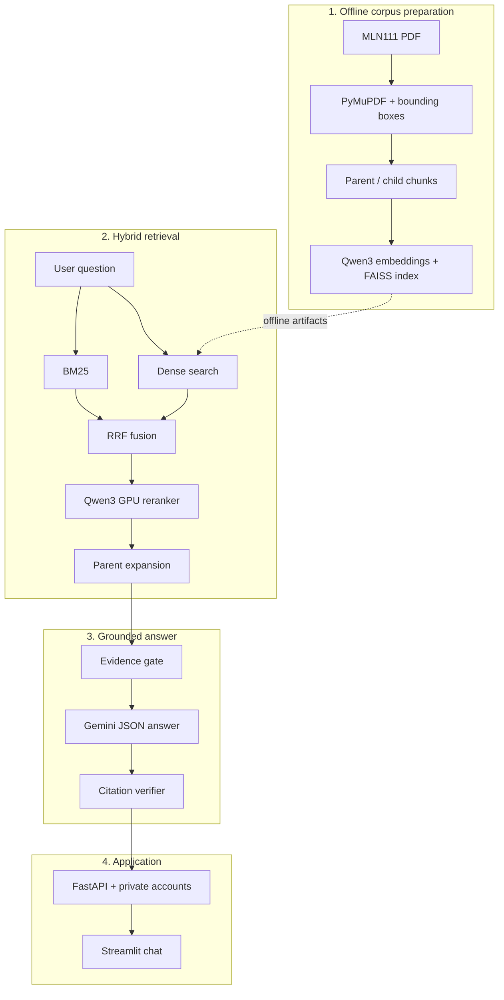

# VietTheory-RAG — MLN111 Assistant

A citation-grounded conversational assistant for the **Marxist–Leninist Philosophy (MLN111)**
textbook. The system retrieves relevant passages, answers in Vietnamese, cites exact PDF pages,
understands conversational follow-ups, and maintains private chat history for each account.

[](https://drive.google.com/drive/folders/1P9UV9NdyWku3mCpswza__0zfxnKPtfmK?usp=sharing)

**[Watch the complete demo on Google Drive](https://drive.google.com/drive/folders/1P9UV9NdyWku3mCpswza__0zfxnKPtfmK?usp=sharing)**

> The production scope is intentionally restricted to MLN111. PDFs and artifacts from other
> subjects remain preserved in the local workspace, but the runtime neither loads nor uses them.

## Highlights

- Hybrid retrieval with BM25 and Qwen3 dense embeddings, fused through Reciprocal Rank Fusion.
- Comparison-aware query planning and Qwen3 cross-encoder reranking on NVIDIA CUDA.
- Heading-aware parent/child chunks: children improve retrieval precision, while parents provide
  complete context for generation and citations.
- A calibrated evidence gate with at most one corrective-retrieval attempt before refusal.
- Gemini structured generation with canonicalized, deduplicated, and deterministically verified
  citations.
- Multi-turn conversations that resolve references such as “they,” “that idea,” and “that
  definition” without contaminating retrieval with older topics.
- Private accounts with scrypt password hashing and SHA-256 session-token storage.
- Ownership checks that isolate every user's conversation history.
- A ChatGPT-style Streamlit interface with expandable full-passage citations.

## System Pipeline



See [docs/architecture.md](docs/architecture.md) for module responsibilities and design details.

| Step | Input → Output | Main technique |
|---:|---|---|
| 1 | PDF → positioned pages, blocks, and lines | PyMuPDF, bounding-box preservation, OCR fallback |
| 2 | Page structure → parent/child chunks | Heading-aware parsing and stable IDs |
| 3 | Question → lexical candidates | Vietnamese-friendly BM25 |
| 4 | Question → semantic candidates | Qwen3-Embedding-0.6B and FAISS cosine search |
| 5 | Two rankings → fused candidates | Reciprocal Rank Fusion and chunk deduplication |
| 6 | Comparison → candidates covering both sides | Query variants and round-robin merge |
| 7 | Candidates → relevance ranking | Qwen3-Reranker-0.6B cross-encoder on CUDA |
| 8 | Child hits → complete source passages | Parent expansion and sibling deduplication |
| 9 | Evidence → accept, rewrite, or refuse | Calibrated evidence gate with one retry |
| 10 | Evidence → structured answer | Gemini Flash Lite, temperature 0.1, JSON schema |
| 11 | Answer → grounded answer | Canonical spans, citation deduplication, verifier |
| 12 | Response → UI and private history | FastAPI, Streamlit, and SQLite ownership checks |

## Models and Techniques

| Component | Selection | Purpose |
|---|---|---|
| Lexical retrieval | BM25 | Exact terms, named entities, and textbook vocabulary |
| Dense retrieval | Qwen3-Embedding-0.6B | Vietnamese paraphrase and semantic matching |
| Vector search | FAISS cosine | Local search with validated manifests and vector mappings |
| Fusion | Reciprocal Rank Fusion | Combines BM25 and dense rankings without score calibration |
| Query planning | Comparison query variants | Ensures both concepts receive retrieval candidates |
| Reranking | Qwen3-Reranker-0.6B | GPU cross-encoder relevance scoring |
| Context expansion | Parent expansion | Complete source passages from precise child hits |
| Generation | Gemini Flash Lite | Vietnamese answers constrained by an `Answer` JSON schema |
| Grounding | Evidence gate and verifier | Scope refusal and deterministic claim–citation validation |
| Serving | FastAPI and Streamlit | API, authentication, history, and chat interface |
| Persistence | SQLite | Users, hashed sessions, conversations, and feedback |

The default runtime uses `Qwen/Qwen3-Embedding-0.6B` revision
`97b0c614be4d77ee51c0cef4e5f07c00f9eb65b3` and `Qwen3-Reranker-0.6B`. Model weights
are loaded from `models/` and are never committed to Git.

## MLN111 Benchmark v1.0

The benchmark was **frozen on 2026-08-12**:

- 70 public, human-verified development questions;
- 30 private, human-verified hidden-test questions;
- 21 easy, 31 medium, and 18 hard development questions;
- 59 single-chunk and 11 multi-chunk development questions;
- 66 answerable, two false-premise, and two out-of-scope development questions;
- frozen schema, corpus manifest, and SHA-256 integrity records.

### Benchmark Results

| Metric | Development | Hidden test |
|---|---:|---:|
| Evaluated retrieval questions | 68 | 28 |
| Recall@1 | 82.35% | 64.29% |
| Recall@3 | 97.06% | 82.14% |
| Recall@5 | **97.06%** | **92.86%** |
| Recall@10 | 97.06% | 92.86% |
| MRR | 89.22% | 75.12% |
| nDCG@5 | 87.70% | 78.04% |
| Evidence Group Recall@1 | 73.42% | 60.00% |
| Evidence Group Recall@3 | 91.14% | 80.00% |
| Evidence Group Recall@5 | 93.67% | 93.33% |
| Evidence Group Recall@10 | 94.94% | 93.33% |
| Partial Evidence Coverage@5 | 94.85% | 92.86% |
| Full Evidence Success@5 | **92.65%** | **92.86%** |
| Full Evidence Success@10 | 94.12% | 92.86% |
| Latency p50 | 10.32 s | 10.33 s |
| Latency p95 | 11.15 s | 10.86 s |

**Evaluation configuration:** BM25 + Qwen3-Embedding-0.6B → RRF →
Qwen3-Reranker-0.6B, with `candidate_k=12` and evaluation through `top_k=10`. The
configuration was frozen before the hidden test was evaluated.

Development retrieval metrics cover **68/70** questions; hidden metrics cover **28/30**. Each
split contains two explicit out-of-scope questions that remain validated benchmark items but are
excluded from the retrieval denominator. Only aggregate hidden metrics are published to prevent
test-set tuning. See [docs/benchmark.md](docs/benchmark.md) for details.

## Repository Structure

```text
src/viettheory/
├── extraction/       PDF extraction, OCR fallback, bounding boxes, structure parsing
├── chunking/         baseline and structured parent/child chunking
├── retrieval/        BM25, FAISS, RRF, query planner, reranker, parent expansion
├── pipeline/         routing, evidence gate, generation, citation verification
├── backend/          FastAPI, authentication, conversations, feedback
├── frontend/         Streamlit UI and assets
├── evaluation/       retrieval and evidence-group metrics
└── runtime.py        MLN111-only production assembly

benchmark/v1.0/       public development split and frozen release manifest
benchmark_private/    hidden test, reviews, and reports; always Git-ignored
scripts/              benchmark preparation and evaluation
tests/                unit, contract, isolation, and smoke tests
```

## Installation

Requirements:

- Python 3.11 or newer;
- an NVIDIA CUDA-capable GPU for the production configuration;
- local embedding and reranker models under `models/`;
- processed MLN111 corpus and index under `data/processed/MLN111/structured_v1/`;
- a valid Gemini API key.

```powershell
python -m venv .venv
.\.venv\Scripts\python.exe -m pip install -e ".[dev,retrieval,app]"
Copy-Item .env.example .env
```

Set `GEMINI_API_KEY` in `.env`. Never commit `.env` or expose the key in screenshots or videos.

## Run Locally

Terminal 1 — API:

```powershell
.\.venv\Scripts\mln111-api.exe
```

Wait for `Application startup complete`, then start the UI in terminal 2:

```powershell
.\.venv\Scripts\python.exe -m streamlit run src\viettheory\frontend\app.py
```

Open `http://localhost:8501`. API health is available at `http://127.0.0.1:8000/health`.

## Quality Checks

```powershell
.\.venv\Scripts\python.exe -m ruff check src tests
.\.venv\Scripts\python.exe -m ruff format --check src tests
.\.venv\Scripts\python.exe -m mypy src
.\.venv\Scripts\python.exe -m pytest -q
```

Current release status: **84 tests passed**, Ruff clean, format clean, and Mypy strict clean.

## Security and Data Rights

- `.env`, `API KEY/`, PDFs, model weights, indexes, processed data, SQLite databases, and logs are
  Git-ignored.
- Passwords are hashed with scrypt and a random salt; plaintext passwords are never stored.
- Session tokens are opaque random values; only SHA-256 digests and seven-day expiration times are
  stored.
- Conversation ownership is enforced on every list, read, chat, and delete endpoint.
- Hidden benchmark content never enters Git history; only aggregate metrics and checksums are
  public.
- The lecturer granted permission to use, publish, and redistribute the textbook PDF. The PDF is
  still excluded from Git to prevent repository bloat. See [docs/data-license.md](docs/data-license.md).
- Quick Tunnels are intended only for temporary demos. A 24/7 deployment requires a GPU host,
  managed HTTPS, and proper secret management.

## Status and Limitations

- The product is operational end to end for MLN111 and has a frozen v1.0 benchmark.
- The runtime is optimized for one local GPU and one API process.
- SQLite is appropriate for a demo or single host; multiple replicas should use PostgreSQL.
- Email verification, password reset, rate limiting, and administrative RBAC are not implemented.
- Internet search is disabled; questions outside MLN111 are explicitly refused.
- PDF files and model weights are not bundled with the repository and must be prepared locally.

## Author

Created by **Tuan**, a gym enthusiast who enjoys studying philosophy.
