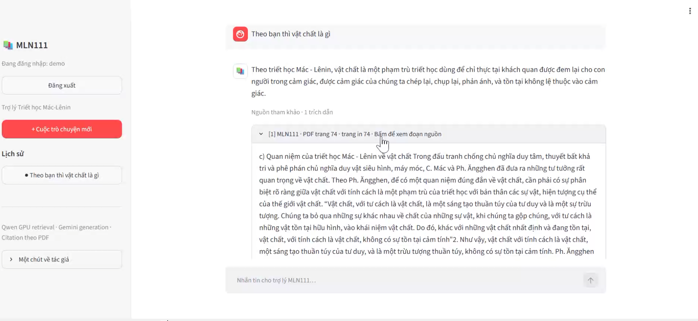
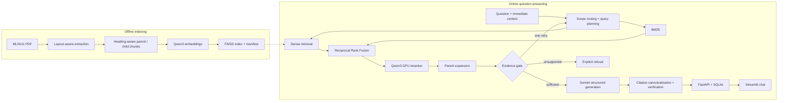

# VietTheory-RAG

**A research-grade, citation-grounded RAG framework for five Vietnamese political-theory
subjects.**

VietTheory-RAG is being developed as one shared data, retrieval, generation, agentic, and
evaluation framework for MLN111, MLN122, MLN131, HCM202, and VNR202. It retrieves textbook
evidence, answers in Vietnamese, cites exact PDF pages, resolves conversational follow-ups, and
keeps each account's chat history private.

[](https://drive.google.com/drive/folders/1P9UV9NdyWku3mCpswza__0zfxnKPtfmK?usp=sharing)

**[Watch the full demo](https://drive.google.com/drive/folders/1P9UV9NdyWku3mCpswza__0zfxnKPtfmK?usp=sharing)** ·
**[Architecture](docs/architecture.md)** · **[Benchmark protocol](docs/benchmark.md)**

> **Current release boundary:** all five corpora have validated extraction, parent/child chunks,
> provenance, and dense indexes. The conversational runtime and frozen quantitative benchmark are
> still MLN111-only. The other four subjects are not claimed as production-ready until shared
> routing and human-reviewed transfer benchmarks are complete.
>
> **Ready means artifact/index integrity ready—not benchmark-ready or production-ready.**

## Five-subject scope

| Subject | Textbook | Extraction | Pages | Searchable children | Data/index gate |
|---|---|---|---:|---:|---|
| MLN111 | Marxist-Leninist Philosophy | Native PDF | 285 | 602 | Passed |
| MLN122 | Marxist-Leninist Political Economy | Native PDF | 262 | 346 | Passed |
| MLN131 | Scientific Socialism | Tesseract OCR | 273 | 334 | Passed |
| HCM202 | Ho Chi Minh Ideology | Tesseract OCR | 271 | 331 | Passed |
| VNR202 | History of the Communist Party of Vietnam | Tesseract OCR | 230 | 490 | Passed |

The deterministic artifact audit validates all five subjects. See the
[five-subject protocol](docs/five-subject-protocol.md),
[implementation roadmap](docs/five-subject-roadmap.md), and
[machine-readable readiness report](reports/five_subject_readiness.json).

## Problem

Answering questions from a long Vietnamese textbook is not just a text-generation problem. A
useful academic assistant must retrieve the right passage despite paraphrases, preserve enough
context to explain an argument, handle questions requiring several pieces of evidence, and show
where every claim came from. It must also refuse unsupported or out-of-scope questions instead of
producing a plausible-sounding answer.

The project therefore targets five coupled problems:

1. **Retrieval:** find the correct evidence for direct, paraphrased, comparative, and multi-part
   questions.
2. **Grounding:** answer only from retrieved MLN111 evidence and attach verifiable PDF citations.
3. **Conversation:** resolve short follow-ups such as “What is their relationship?” without
   allowing older topics to contaminate retrieval.
4. **Productization:** provide authentication, isolated chat history, a usable interface, and a
   reproducible evaluation contract.
5. **Cross-subject generalization:** develop the method deeply on MLN111, then apply it unchanged
   to four additional subjects and measure transfer rather than silently retuning each corpus.

## Design Questions

- How should a structured textbook be chunked without losing headings, arguments, and page
  provenance?
- When should lexical retrieval outperform semantic retrieval, and how can both be combined
  without calibrating incompatible scores?
- How can comparison and multi-evidence questions retrieve all required concepts rather than one
  locally relevant passage?
- How much context should be given to the generator without weakening retrieval precision?
- When should the system retry retrieval, answer, or refuse?
- How can citations be made deterministic instead of trusting citation text produced by an LLM?
- How should follow-up context be used while preventing topic drift?
- How can a benchmark remain useful for tuning without leaking its hidden test?

## Key Contributions

- **Structure-aware parent/child corpus:** small child chunks optimize retrieval; bounded parent
  passages preserve complete arguments for generation and display.
- **Vietnamese hybrid retrieval:** BM25 and Qwen3 dense search are fused with Reciprocal Rank
  Fusion, then reranked by a Qwen3 cross-encoder on CUDA.
- **Comparison-aware planning:** decomposed query variants retrieve both sides of a comparison and
  merge candidates before reranking.
- **Evidence-aware answering:** a calibrated evidence gate permits at most one corrective retrieval
  attempt before answering or refusing.
- **Deterministic citation grounding:** generated citations are canonicalized against retrieved
  spans, deduplicated, and verified claim by claim.
- **Conversation isolation:** immediate-turn context resolves ellipsis while authenticated ownership
  checks keep every user's conversations private.
- **Frozen evaluation:** MLN111 Benchmark v1.0 contains 70 public development questions and a
  private 30-question hidden test with manifests and SHA-256 integrity records.

## System



| Stage | Implementation | Responsibility |
|---|---|---|
| Extraction | PyMuPDF, bounding boxes, OCR fallback | Preserve page, block, line, and layout metadata |
| Chunking | Heading-aware parent/child chunks | Balance retrieval precision and complete context |
| Lexical retrieval | BM25 | Match terminology, named entities, and exact phrases |
| Dense retrieval | Qwen3-Embedding-0.6B + FAISS | Match Vietnamese paraphrases and related concepts |
| Fusion | Reciprocal Rank Fusion | Combine rankings without score calibration |
| Planning | Comparison query variants | Cover both sides of comparison questions |
| Reranking | Qwen3-Reranker-0.6B | Score question–passage relevance on CUDA |
| Grounding | Parent expansion + evidence gate | Supply complete evidence and reject weak context |
| Generation | Gemini Flash Lite, JSON schema, temperature 0.1 | Produce constrained Vietnamese answers |
| Verification | Canonical spans + deterministic checks | Remove duplicate or unsupported citations |
| Application | FastAPI, Streamlit, SQLite | Serve accounts, conversations, feedback, and UI |

The embedding model is pinned to revision
`97b0c614be4d77ee51c0cef4e5f07c00f9eb65b3`. Model weights, indexes, and processed
corpora are local artifacts and are not committed.

## Benchmark

**MLN111 Benchmark v1.0** was frozen on **2026-08-12** against corpus artifact
`mln111_corpus_2026_07_1`.

| Property | Development | Hidden test |
|---|---:|---:|
| Total questions | 70 | 30 |
| Retrieval-answerable questions | 68 | 28 |
| Explicit out-of-scope questions | 2 | 2 |
| Human review | Verified | Verified |
| Public question-level data | Yes | No |

The development split contains 21 easy, 31 medium, and 18 hard questions; 59 single-chunk and
11 multi-chunk questions; and a mix of definition, explanation, paraphrase, synthesis,
misconception, temporal, entity, cause–effect, enumeration, comparison, and application types.

Multi-evidence questions define required evidence groups. A retrieval is fully successful only if
at least one acceptable chunk is returned for **every** required group. The hidden questions,
answers, gold evidence, reviews, and per-question results remain Git-ignored; only aggregate
metrics and checksums are published.

## Baselines & Ablations

All ablations below were measured on the same 68 retrieval-answerable development questions. The
two explicit out-of-scope questions remain benchmark items but have no gold retrieval groups. Dense
variants share the pinned Qwen3 embeddings; hybrid retrieval uses RRF with a 30-result pool; and
reranker variants score 12 candidates with Qwen3-Reranker-0.6B.

| Corpus and retrieval configuration | Recall@1 | Recall@5 | MRR | nDCG@5 | Full evidence@5 |
|---|---:|---:|---:|---:|---:|
| Fixed-size · BM25 | 52.94% | 86.76% | 66.93% | 53.04% | 86.76% |
| Fixed-size · Dense | 66.18% | 89.71% | 76.45% | 59.69% | 86.76% |
| Fixed-size · BM25 + Dense + RRF | 75.00% | 95.59% | 82.86% | 63.72% | **95.59%** |
| Structured child · BM25 | 51.47% | 85.29% | 66.33% | 67.60% | 77.94% |
| Structured child · Dense | 58.82% | 92.65% | 74.15% | 75.34% | 85.29% |
| Structured child · BM25 + Dense + RRF | 61.76% | 95.59% | 76.48% | 78.19% | 89.71% |
| Structured child · Hybrid + reranker | **83.82%** | **98.53%** | **90.69%** | **88.78%** | 92.65% |
| Structured child · Planner + hybrid + reranker | **83.82%** | **98.53%** | **90.69%** | **88.78%** | 92.65% |

Fixed-size gold IDs cannot be compared directly with structured child IDs. For that ablation, each
verified gold child is mapped to fixed chunks through exact shared source spans (page ID, bounding
box, and line text). Quality is computed from cached rankings, so ablation latency is deliberately
omitted; the end-to-end latency in the Results section comes from the canonical evaluator.

The experiment shows three useful trade-offs. First, dense retrieval improves over BM25 alone and
RRF improves over either component. Second, the reranker is responsible for the largest structured
ranking gain: +22.06 points Recall@1 over structured hybrid. Third, the current comparison planner
does not change aggregate development metrics; its query variants converge to the same final
candidate set after fusion and reranking. Fixed-size hybrid achieves the strongest full-evidence
coverage in this isolated retrieval test, while structured children achieve materially higher
nDCG after reranking and retain bounded parent context for generation and citations.

Reproduce the table with:

```powershell
.\.venv\Scripts\python.exe scripts\evaluate_mln111_ablations.py
```

The machine-readable report is
[`benchmark/reports/mln111_v1_ablations.json`](benchmark/reports/mln111_v1_ablations.json).

## Results

The configuration was frozen before the hidden test was evaluated.

| Metric | Development (n=68) | Hidden test (n=28) |
|---|---:|---:|
| Recall@1 | 83.82% | 64.29% |
| Recall@3 | 98.53% | 82.14% |
| Recall@5 | **98.53%** | **92.86%** |
| Recall@10 | 98.53% | 92.86% |
| MRR | 90.69% | 75.12% |
| nDCG@5 | 88.78% | 78.04% |
| Evidence Group Recall@1 | 74.68% | 60.00% |
| Evidence Group Recall@3 | 92.41% | 80.00% |
| Evidence Group Recall@5 | 93.67% | 93.33% |
| Evidence Group Recall@10 | 94.94% | 93.33% |
| Partial Evidence Coverage@5 | 95.59% | 92.86% |
| Full Evidence Success@5 | **92.65%** | **92.86%** |
| Full Evidence Success@10 | 94.12% | 92.86% |
| Latency p50 | 11.41 s | 10.33 s |
| Latency p95 | 11.91 s | 10.86 s |

The two out-of-scope questions in each split are validated benchmark items but are excluded from
the retrieval denominator. See [docs/benchmark.md](docs/benchmark.md) and the public
[release manifest](benchmark/v1.0/release_manifest.json) for the evaluation contract and hashes.

## Error Analysis

- **Ranking is the main remaining gap.** Hidden Recall@5 is 92.86%, but Recall@1 is 64.29% and
  MRR is 75.12%. Relevant evidence is often present in the candidate set but not consistently
  ranked first.
- **Most retrieval gains saturate by k=5.** Hidden Recall@5 and Recall@10 are identical, so simply
  returning more passages does not recover the remaining failures.
- **Multi-evidence coverage is harder at shallow ranks.** Hidden Evidence Group Recall rises from
  60.00% at k=1 to 93.33% at k=5, supporting explicit query decomposition and group-aware
  evaluation.
- **Development performance is more optimistic at early ranks.** The development-to-hidden gap is
  18.06 points at Recall@1 but only 4.20 points at Recall@5, indicating that ranking quality
  generalizes less strongly than candidate recall.
- **Latency is dominated by the neural path.** Approximately 10.3 s median latency is acceptable
  for a local research demo, not for a responsive production service. Reranking and generation
  remain the primary optimization targets.

These conclusions use aggregate metrics only. Hidden examples are intentionally not exposed or
used for post-hoc tuning.

### Per-query delta analysis

Cached development rankings provide a more diagnostic view of each pipeline transition:

| Transition | Wins | Losses | Mixed | Ties |
|---|---:|---:|---:|---:|
| Structured BM25 → Dense | 20 | 14 | 0 | 34 |
| Dense → Hybrid RRF | 19 | 9 | 1 | 39 |
| Hybrid RRF → Reranker | **21** | 2 | 1 | 44 |
| Reranker → Comparison planner | 0 | 0 | 0 | 68 |

“Mixed” means first-gold rank and complete evidence coverage moved in opposite directions. This
matters for multi-evidence questions: a higher first relevant passage can still hide the loss of a
second required evidence group.

Child-level evaluation reports five incomplete top-five cases. Manual parent-aware review shows
that four are already resolved by production parent expansion: the retrieved child and missing
gold sibling share the same parent. Only one case remains a genuine parent-context miss. This
narrows the next research question considerably: an evidence-guided retry must first distinguish a
true context gap from a child-ID evaluation gap. The current comparison planner is a measured
no-op on this development set and is retained as a negative ablation, not part of baseline B0.

See the complete question-level changes in
[`reports/mln111_v1_per_query_deltas.md`](reports/mln111_v1_per_query_deltas.md) and the
[machine-readable delta report](benchmark/reports/mln111_v1_per_query_deltas.json).
The manual audit is documented in
[`reports/mln111_v1_failure_analysis.md`](reports/mln111_v1_failure_analysis.md).

## Production Implementation

### Repository layout

```text
src/viettheory/
├── extraction/       PDF extraction, OCR fallback, and structure parsing
├── chunking/         fixed-size and structured parent/child chunking
├── retrieval/        BM25, FAISS, RRF, planner, reranker, parent expansion
├── pipeline/         routing, evidence gate, generation, citation verification
├── backend/          FastAPI, authentication, conversations, feedback
├── frontend/         Streamlit chat interface and assets
├── evaluation/       retrieval and evidence-group metrics
└── runtime.py        MLN111-only production assembly

benchmark/v1.0/       public development set and frozen release manifest
benchmark_private/    hidden test and private reports; always Git-ignored
scripts/              corpus, benchmark, and evaluation commands
tests/                unit, contract, isolation, and smoke tests
```

### Local installation

Requirements: Python 3.11+, an NVIDIA CUDA-capable GPU for the production configuration, local
embedding/reranker weights under `models/`, the processed MLN111 artifacts, and a Gemini API key.

```powershell
python -m venv .venv
.\.venv\Scripts\python.exe -m pip install -e ".[dev,retrieval,app]"
Copy-Item .env.example .env
```

Set `GEMINI_API_KEY` in `.env`. Never commit `.env` or expose the key in screenshots, logs, or
videos.

Run the API:

```powershell
.\.venv\Scripts\mln111-api.exe
```

After `Application startup complete`, run the interface in a second terminal:

```powershell
.\.venv\Scripts\python.exe -m streamlit run src\viettheory\frontend\app.py
```

Open `http://localhost:8501`; API health is available at `http://127.0.0.1:8000/health`.

### Security and operational boundary

- Passwords use scrypt with a random salt; plaintext passwords are never stored.
- Session tokens are random opaque values; only SHA-256 digests and expiration times are stored.
- Every conversation query enforces `conversation_id` and `user_id` ownership.
- `.env`, `API KEY/`, PDFs, models, indexes, processed data, SQLite databases, logs, and hidden
  benchmark data are Git-ignored.
- Internet search is disabled. Questions outside MLN111 are explicitly refused.
- SQLite and a single CUDA-backed API process suit a local demo. Multi-user deployment should add
  PostgreSQL, managed secrets, TLS, rate limiting, backups, monitoring, and horizontal-worker
  coordination.

### Verification

```powershell
.\.venv\Scripts\python.exe -m ruff check src tests
.\.venv\Scripts\python.exe -m ruff format --check src tests
.\.venv\Scripts\python.exe -m mypy src
.\.venv\Scripts\python.exe -m pytest -q
```

Release status: **84 tests passed**, Ruff clean, formatting clean, and Mypy strict clean.

## Author

Created by **Tuan**, an AI engineer and gym enthusiast who enjoys studying philosophy.
